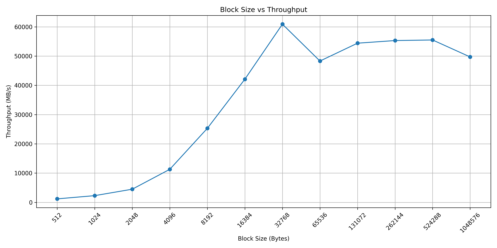
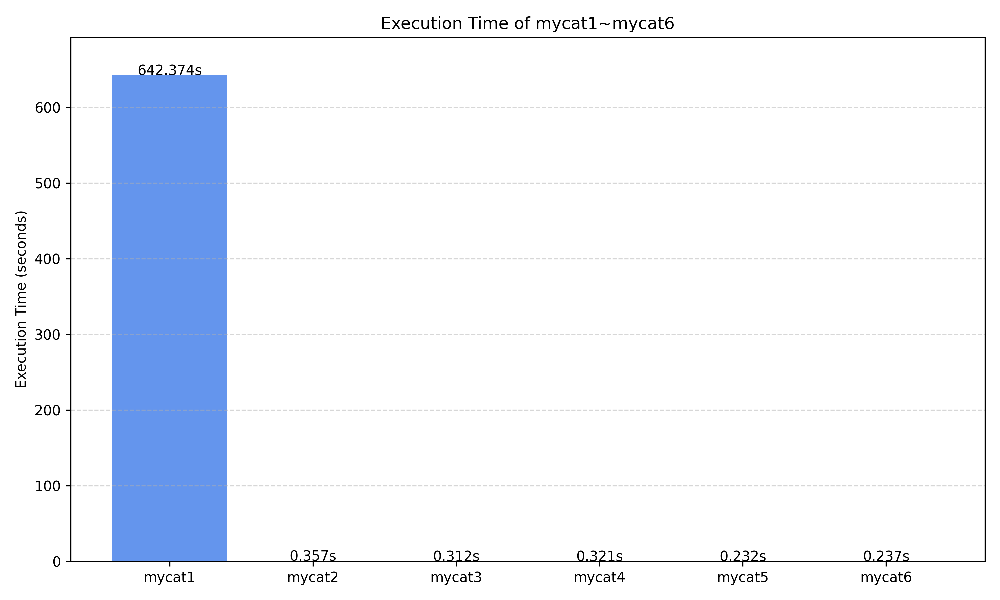

# Meowhw实验报告

| 姓名   | 学号       |
| ------ | ---------- |
| 谷明航 | 2023202243 |


## 任务3：缓冲区对齐的cat

1. **为什么将缓冲区对齐到系统的内存可能提高性能？你的实验结果支持这个猜想吗？为什么？**

   因为mycat3可以保证让缓冲区页对齐。mycat2只保证最小对齐，可能处于页中部，所以当缓冲区恰好位于两个页的边界时，需要进行跨页的访问操作。而mycat3由于是页对齐的，在进行读写时减少内存页的跨页操作，提高内存访问效率。同时因为不会跨多个 cache line 或页，缓存命中率更高，也会减少TLB miss。

   实验结果支持这个猜想，平均耗时从mycat2的 `357.1 ms ±  15.6 ms`提升到了mycat3的`311.7 ms ±  16.5 ms`

2. **为什么我们直接使用`malloc`函数分配的内存不能对齐到内存页，即使我们分配的内存大小已经是内存页大小的整数倍了。**

   因为 `malloc` 的返回地址一般只满足保证最小对齐，16或8字节对齐。同时根据我们学到的malloc分配块的格式，需要在分配的分配块前面添加header，记录块大小和前后块是否分配等信息，所以即使分配的内存大小是页大小的整数倍，`malloc`返回的地址仍可能不是页对齐的。

3. **你是怎么在不知道原始的malloc返回的指针的情况下正确释放内存的？**

   `align_alloc` 使用了 `posix_memalign`，它内部仍然使用了 `malloc` 实现，会返回页对齐地址。虽然只接收到一个对齐后的指针，但是这个函数内部已经处理好了内存管理的细节，确保这个对齐指针本身就可以直接传给 `free` 来安全释放。所以即使不知道原始的 `malloc` 返回指针地址，`posix_memalign` 也可以保证返回的指针是一个可以被正确释放的地址。


## 任务4: 设置缓冲区大小为文件系统块大小的整数倍的cat

1. **为什么在设置缓冲区大小的时候需要考虑到文件系统块的大小的问题？**
    在 Unix 系统中，磁盘 I/O 是以“块”为单位进行的，而文件系统为每个文件定义了推荐的块大小。当应用程序使用与块大小对齐的缓冲区进行读写时，可以：

   1. 减少磁盘I/O操作：

      因为文件系统是以块为单位组织数据的，所以匹配块大小的读取可以减少磁盘寻址次数，提高磁盘的访问效率。

   2. 避免额外的块读取：

      如果缓冲区小于文件块大小，会导致多次读取同一个块。如果缓冲区大于文件块大小，会因为不对齐导致跨块读取。所以考虑文件系统块大小可以避免因不对齐读写导致的额外数据拷贝和缓冲开销。

2. **对于上面提到的两个注意事项你是怎么解决的？**

   - 注意事项 1：文件系统中的每个文件，块大小不总是相同的。

     解决方式：在 `io_blocksize` 函数中通过 `fstat(fd, &statbuf)` 获取每个具体文件的块大小（`statbuf.st_blksize`），按照每个文件的不同获取不同的块大小。

   - 注意事项 2：有的文件系统可能会给出虚假的块大小，这种虚假的块大小可能根本不是 2 的整数次幂。

     解决方式：在代码中添加了判断 `is_power_of_two()`，检查块大小是否是2的整数次幂，只有当块大小是 2 的整数次幂时才使用。否则，使用系统页大小分配4KB。


## 任务5: 考虑系统调用开销情况下的cat

1. **解释一下你的实验脚本是怎么设计的。你应该尝试了多种倍率，请将它们的读写速率画成图表包含在文档中。**

   实验脚本利用 `dd` 命令读取 `/dev/zero` 并写入 `/dev/null` 来测试不同缓冲区大小下的吞吐性能。

   - `/dev/zero` 模拟源文件，提供无限的零字节内容，`/dev/null` 模拟目标文件，写入后直接丢弃。所以这个过程不会受到磁盘 I/O 的干扰，专注测试系统调用的影响
   - 每轮测试将 `bs`（缓冲区大小）设置为 `2^i`，其中 `i` 从 `9` 到 `20`，即尝试了从 512B 到 1MB。记录每个 `bs` 对应的吞吐率，单位是MB/s，保存到 `result.csv`。下面是根据结果绘制的图表。

   


## 任务6: 使用了系统调用fdadvice的cat

1. **你是如何设置`fadvise`的参数的？**

   我使用了系统调用

   ```
    posix_fadvise(fd, 0, 0, POSIX_FADV_SEQUENTIAL)
   ```

   - `fd`表示打开的文件描述符
   - `offset = 0`, `len = 0`表示对整个文件提示
   - `POSIX_FADV_SEQUENTIAL`表示顺序访问文件，这样操作系统可以根据顺序访问的特性来提前增加预读(readahead)窗口

2. **对于顺序读写的情况，文件系统可以如何调整readahead？对于随机读写的情况呢？**

   | 访问模式 | 操作系统优化方式（Readahead）                                |
   | -------- | ------------------------------------------------------------ |
   | 顺序读写 | 可以提前预读多个连续块（readahead），减少 `read()` 的延迟，提升性能。 |
   | 随机读写 | 会减少甚至完全禁用预读，因为无法预测下一次读取位置。         |


## 任务7：总结

**1.柱状图**



可以看到由于mycat1的时间太长了，其它几个程序和它的对比很明显，其它基本是以ms为单位的。

**2.分析：**

| 版本   | 优化点                       | 时间 (s) | 原因分析                                      |
| ------ | ---------------------------- | -------- | --------------------------------------------- |
| mycat1 | 逐个字符 I/O                 | 642.374  | 每次调用 `read`/`write` 系统调用，效率极低    |
| mycat2 | 使用页大小缓冲 (4096 字节)   | 0.3571   | 明显减少系统调用次数，性能大幅提升            |
| mycat3 | 添加页对齐                   | 0.3117   | 页对齐对页缓存更友好，系统调用开销更低        |
| mycat4 | 综合考虑文件块大小           | 0.3213   | 与 mycat3 相近，说明块大小调整并非关键瓶颈    |
| mycat5 | 设置最佳缓冲区（32768 32KB） | 0.2323   | 大块缓冲显著减少系统调用次数，提高吞吐率      |
| mycat6 | 加入 `fadvise` 提示顺序读    | 0.2371   | 与 mycat5 相近，表明 `fadvise` 对性能提高较小 |

上面的结果基本符合预期，整体按实验步骤时间减少，效率呈上升趋势。除了mycat4的效率与mycat3相差不大，mycat6和mycat5相差不大。这可能是由于当缓冲优化已足够时，考虑文件块大小，fadvise、对齐等作用较小，不是限制效率的瓶颈。

启示与总结：

1. 系统调用次数是影响文件读写效率的决定性因素。mycat1 的逐字节 I/O 产生系统调用次数极多，上下文切换的成本巨大。这导致了mycat2引入缓冲区直接减少大量系统调用，导致性能极大幅度提高。
2. 实际场景下，32KB作为缓冲区大小读取的效率最高，这一步优化对性能提高有重要影响。
3. 使用页对齐的技术也可以进一步提高效率，因为这避免了从某个page中间开始读和跨页读取的情况。

在真实场景中，为了提高cat的性能，需要避免逐字节或小数据块 I/O，使用缓冲区，大小至少匹配内存页（4KB/8KB），采用页对齐技术。同时可以根据真实的情况来确定最优的缓冲区大小，并对顺序访问使用 `posix_fadvise`。
